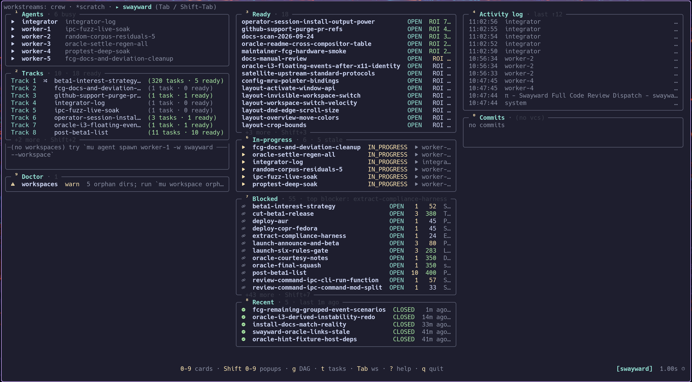

# mu

**A small control plane for a crew of AI coding agents working in
parallel.** Agents run in multiplexer panes you can attach to. Work is a
task DAG in SQLite. Each agent gets its own VCS workspace.



*Bare `mu` opens a read-only dashboard: agents, tracks, ready,
in-progress, and blocked tasks, the log tail, workspaces, and doctor.*

- **Parallel work that does not collide.** Per-agent workspaces (jj
  workspaces, sl shares, or git worktrees) and a task DAG with
  `blocks` edges keep agents out of each other's way.
- **State that outlives a pane.** One SQLite DB holds agents, tasks,
  owners, notes, and workspaces. An append-only ops log records every
  change, so `mu undo <group>` reverses one action and `mu rebuild`
  replays the whole history.
- **Exact control of pi agents.** mu's pi extension serves a control
  socket inside each agent, so send, state, wait, and abort are exact,
  locally and over ssh. The pane stays pi's normal TUI.

mu persists state and coordinates handoffs. It does not choose models,
run your tests, or pass messages between agents. Every read path has
`--json`, and every change goes through a typed CLI verb.

## Install

```bash
npm i -g @mu-crew/mu
mu link pi       # pi extension (control socket, mu_delegate) + the mu skill
mu doctor
```

To drive mu from another agent CLI (claude-code, codex), install the
skill with `npx skills add mu-crew/mu` instead of `mu link pi`.

You need:

- Node 22.12–26 (see `.nvmrc`).
- tmux ≥ 3.0 or [herdr](https://github.com/herdrdev/herdr). `mu doctor`
  reports which one is active.
- pi, or another agent CLI.
- jj, sl, or git on `PATH` for `--workspace`.

[murmur](https://github.com/mu-crew/murmur) is optional for pi agents.
Non-pi agents on tmux need it for state: without it their state is
`unknown`, so `mu agent wait` and stall detection never fire for them.
On herdr, herdr reports state.

To update or run from a checkout, see
[How to upgrade mu](docs/guide/upgrade.md).

## Quick start

Run this inside tmux or herdr:

```bash
mu workstream init auth
mu task add design_auth --title "Design auth" --impact 80 --effort-days 2
mu task add build_auth  --title "Build auth"  --impact 80 --effort-days 5 --blocked-by design_auth
mu agent spawn worker-1 --workspace
mu task claim design_auth --for worker-1
mu agent send worker-1 --fresh 'Do task design_auth. Close it with evidence.'
mu task wait design_auth --first --on-stall exit   # exit 7 = worker needs you
mu                                                  # dashboard
mu workstream teardown --yes                        # without --yes: dry run
```

For one helper, ask pi to delegate (`mu_delegate` ships with `mu link
pi`), or spawn into the reserved `scratch` workstream:
`mu agent spawn scout-1 -w scratch`.

## mu delegates vs hidden subagents

Claude Code, Codex, and pi-subagents delegate to a hidden child process
and return only its result. A mu delegate is an ordinary agent in a
pane.

|                         | Hidden subagent          | mu delegate |
| ----------------------- | ------------------------ | ----------- |
| Visibility              | none while it runs       | a pane; attach and watch |
| Steer mid-run           | no                       | `mu agent send`; stop with `mu agent abort` |
| Keep talking after it answers | no                 | yes, with `keep: true` |
| Transcript              | collapses into a result  | a normal pi session log |
| If the work grows       | re-brief a new agent     | same task DAG and workspaces |
| Cost                    | light                    | one pane and one pi process |

For many tiny calls, a hidden subagent is lighter. mu bets that seeing
and steering agent work is worth a pane.

## Documentation

- [Getting started](docs/guide/getting-started.md): the first
  workstream, end to end. Start here.
- [User guide](docs/guide/README.md): how-tos for dispatch, remote
  workers, sync, recovery, and the dashboard.
- [skills/mu/SKILL.md](skills/mu/SKILL.md): what an orchestrating
  agent reads. [REMOTE_WORKERS.md](skills/mu/REMOTE_WORKERS.md) covers
  agents on other machines.
- [ARCHITECTURE.md](docs/ARCHITECTURE.md) and
  [docs/architecture/](docs/architecture/): the module map and deep
  dives.
- [VISION.md](docs/VISION.md): the design pillars.
  [ROADMAP.md](docs/ROADMAP.md): what is next and what is rejected.
- [VOCABULARY.md](docs/VOCABULARY.md): canonical terms.
- [CHANGELOG.md](CHANGELOG.md): release notes.

`mu <verb> --help` is the reference for every flag.

## License

MIT. Part of [mu-crew](https://github.com/mu-crew). Written mostly by AI
coding agents, with a human reviewing what ships.
